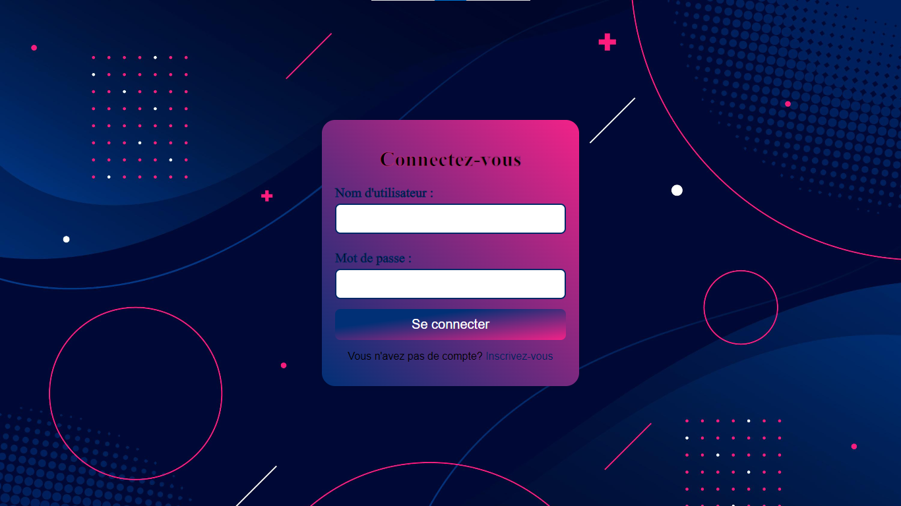

# W3schools-simple-html-css-clone-lookalike

📝 **Project Overview**: This is a simple W3Schools clone made using only HTML and CSS for a school project.

If you're interested in using this repository as a template, please consider forking it and leaving a star.

<div align="center">
  
  
  
  
  <a>
    
  </a>
</div>

## Table of Contents
- [🚀 Demo](#demo)
- [🖼️ Screenshots](#screenshots)
- [💻 Technologies](#technologies)
- [⚙️ Installation](#installation)
- [📜 License](#license)

## Demo

[View the live demo](https://shadowxdgamer.github.io/w3schools-simple-html-css-clone/source/index.html)

## Screenshots

*Example of a tutorial page with a similar layout.*


*The homepage layout replicating the W3Schools style.*

## Features

✨ **Key Features**:
- Recreates the W3Schools HTML & CSS tutorial interface
- Responsive design that works on various screen sizes
- Includes interactive elements similar to W3Schools, such as code editors and examples
- Clean and well-organized codebase

## Technologies

🛠️ **Built With**:
- **HTML5**
- **CSS3**

## Installation

1. **📥 Clone the repository**:
   ```bash
   git clone https://github.com/your-username/w3schools-clone.git
   cd w3schools-clone

## 📄 License

This project is licensed under the MIT License. 
